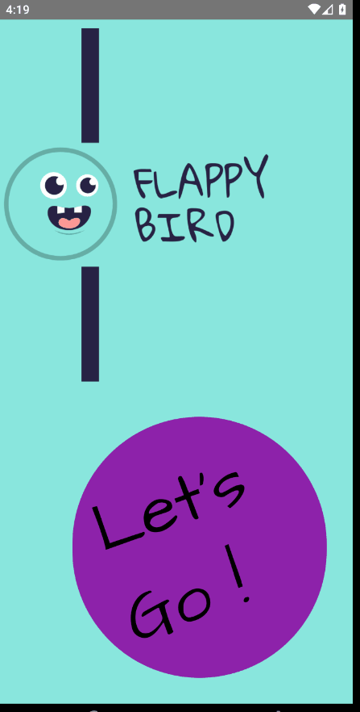

<h1 align="center">FlappyBird Game App</h1>

  <h3>
    <a href="https://github.com/NureddinHasanBikec/Flappy_Bird_Game">
      Project Source
    </a>
 
  </h3>

<!-- TABLE OF CONTENTS -->

## Table of Contents

- [Overview](#overview)
- [Built With](#built-with)
- [Features](#features)
- [Acknowledgements](#acknowledgements)
- [Contact](#contact)

<!-- OVERVIEW -->
    
  
  |  Game   | 
  |-------------------| 
  | |  

  ### Built With

<!-- This section should list any major frameworks that you built your project using. Here are a few examples.-->

- [React-native](https://reactnative.dev/)

## Features

- Google Font is used in the application.
- TouchableWithoutFeedback is the most important component of the application. 
- When the application is opened, the start page welcomes you.
- Then you aim to pass the square moving in the right direction through the rectangular obstacles.
- When you get stuck in obstacles, your score is reflected on the screen.

 
## Acknowledgements

<!-- This section should list any articles or add-ons/plugins that helps you to complete the project. This is optional but it will help you in the future. For exmpale -->

-  <a href="https://fonts.google.com/" rel="nofollow">Google Fonts</a>

## Contact

- GitHub [NureddinHasanBikec](https://github.com/NureddinHasanBikec)
- Linkedin [@Nureddin Hasan Bikeç](https://www.linkedin.com/in/nureddin-hasan-bikeç)
